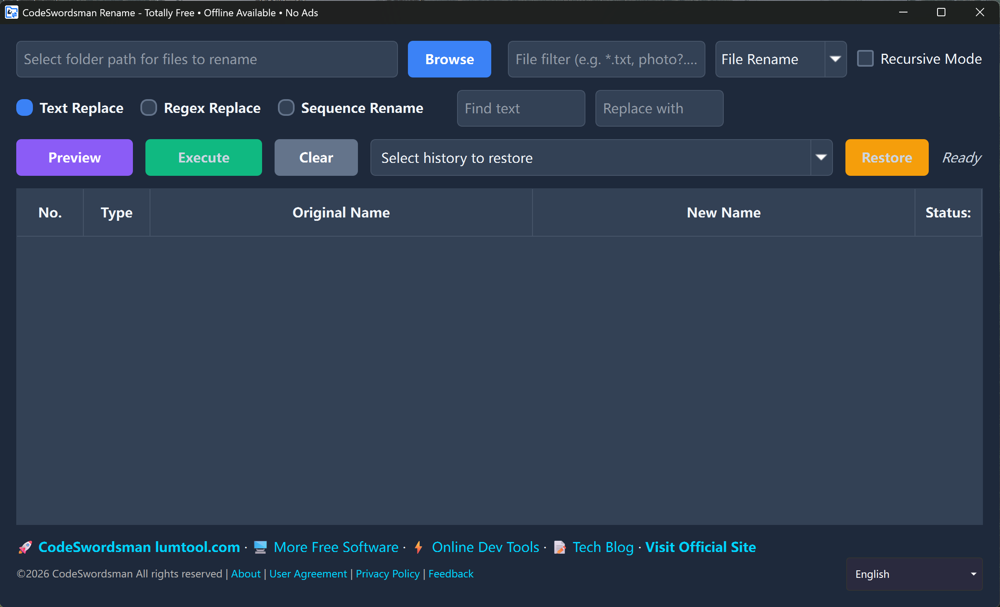
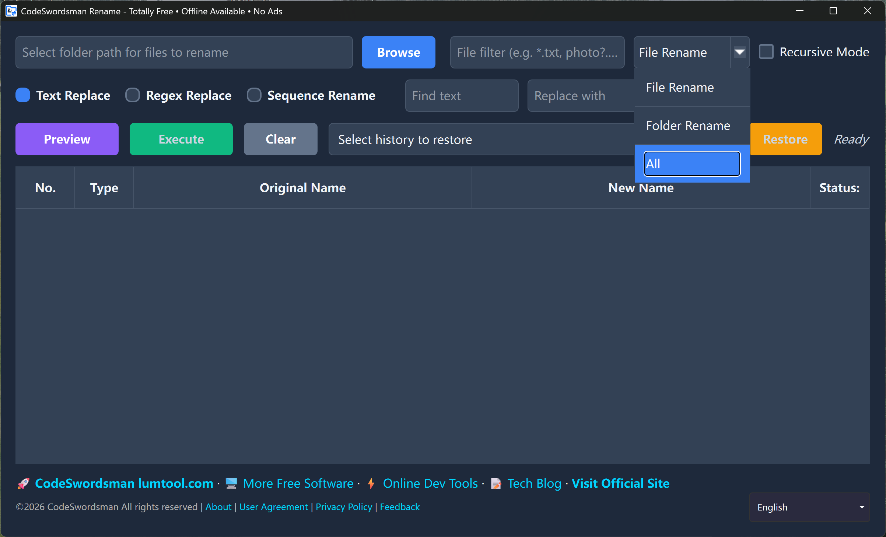
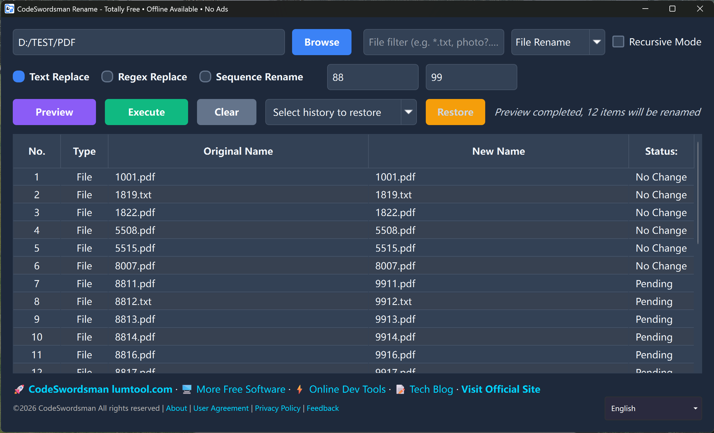
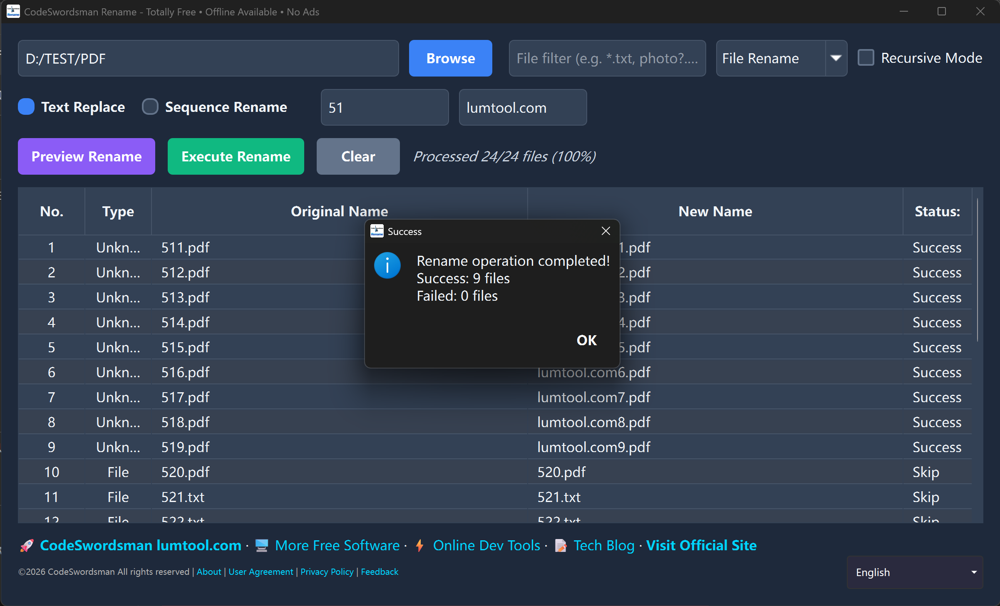
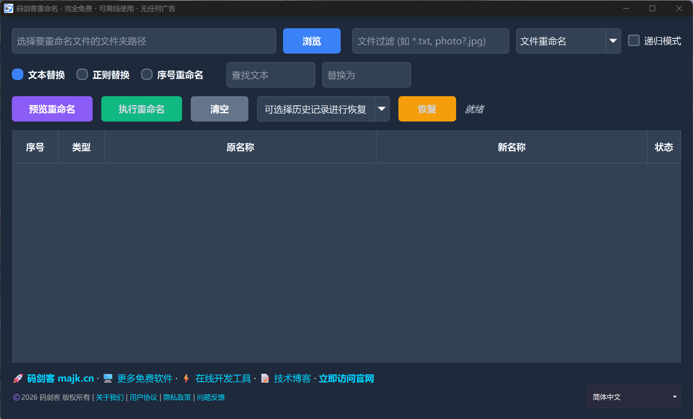
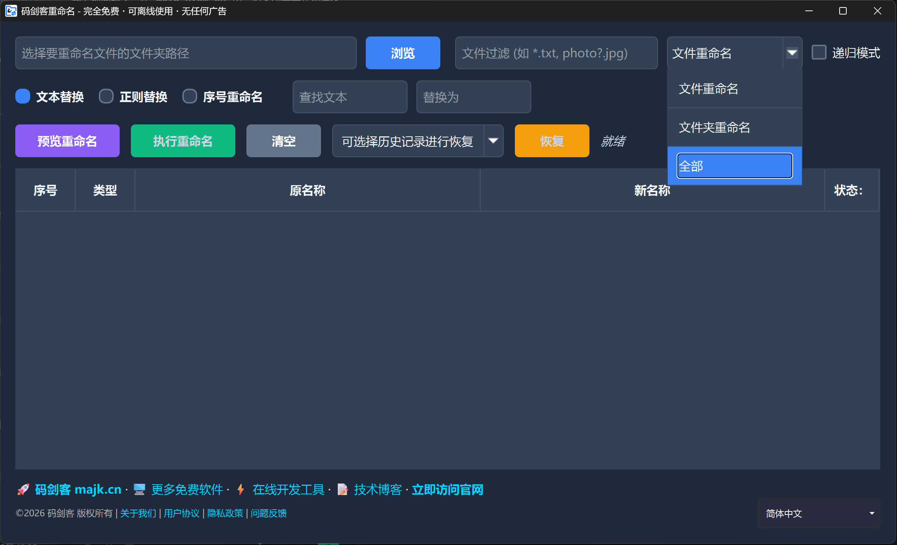
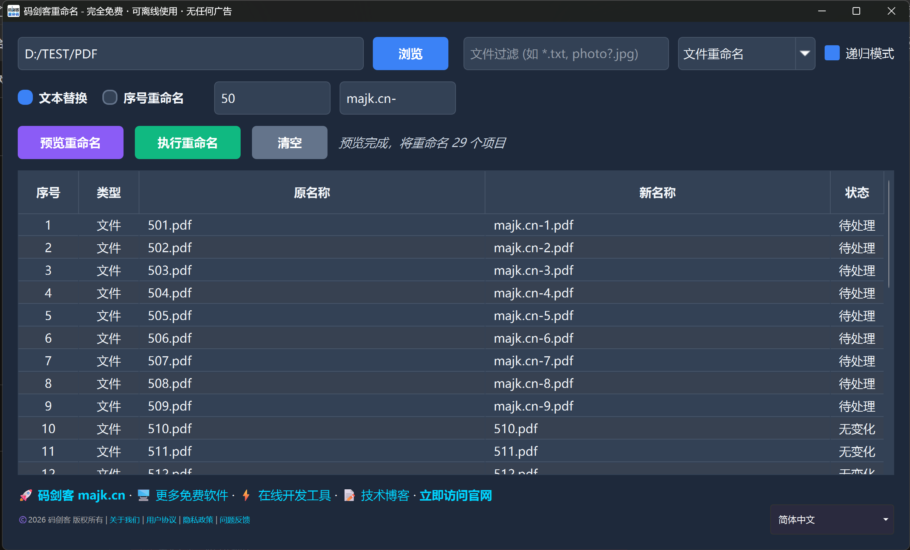
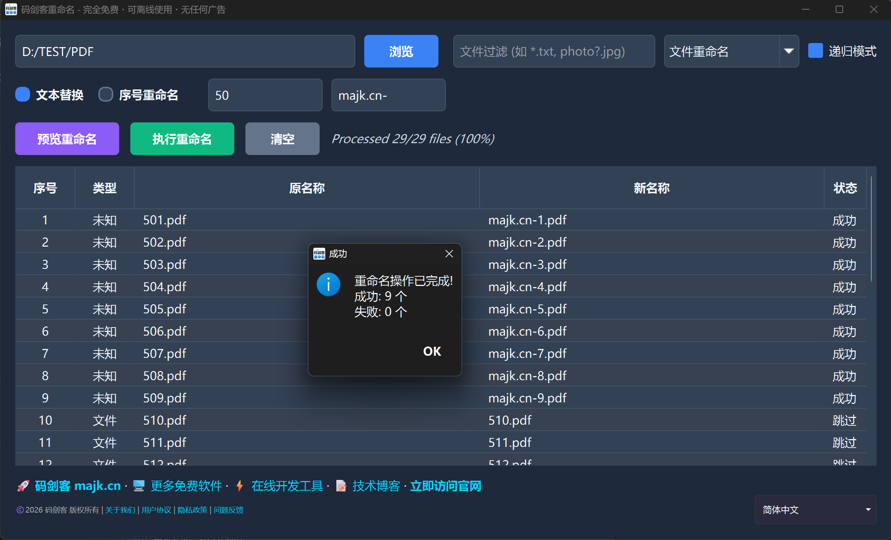

# 码剑客重命名 / CodeSwordsman Renamer
Free, powerful, and easy-to-use batch file renamer for Windows.

---

## 📖 About Us / 关于我们
致力于开发优秀的免费软件工具，深耕实用型工具领域，秉持高效、便捷的理念，为全球用户提供简洁易用、功能靠谱的使用体验，助力用户提升效率、简化操作。
We are committed to developing excellent free software tools, focusing on the field of practical utilities. Upholding the principles of efficiency and convenience, we provide users worldwide with a simple, easy-to-use and reliable experience, helping them improve efficiency and simplify operations.
中文官网：[https://www.majk.cn](https://www.majk.cn)
English Website：[https://lumtool.com](https://lumtool.com)

---

## ✨ Features / 功能特性
- **Batch File Renaming**: Process thousands of files with one click, 80% efficiency improvement
  批量文件重命名，一键处理数千个文件，大幅提高工作效率
- **Wildcard Matching**: Support * (any characters) and ? (single character) for precise file targeting
  通配符匹配，支持 *（任意字符）和 ?（单个字符）匹配文件，精确定位目标文件
- **Wildcard Replacement**: Batch replace specified characters in filenames
  通配符替换，批次替换文件名中的指定字符，轻松统一文件命名格式
- **Sequence Renaming**: Rename files sequentially with custom prefix and sequence format
  序列重命名，按序列重命名文件，支持自定义前缀和序列格式，实现有组织的文件管理
- **Real-time Preview**: Preview changes before execution to avoid mistakes
  实时预览，执行前预览功能，避免误操作造成的文件混乱
- **Folder Support**: Support folder operations, optional folder inclusion in renaming
  文件夹支持，支持选择文件夹进行操作，可选择是否包含文件夹进行重命名
- **Multi-thread Processing**: High-speed processing for large batches
  多线程处理，批量处理1000+文件，快速高效
- **100% Free**: No ads, no bundles, no hidden fees
  完全免费，无广告、无捆绑、无隐藏收费
- **Offline Use**: No network connection required
  可离线使用，无需网络连接，随时随地使用

### 🖼️ Software Interface / 软件界面

#### English Interface
| Main Interface | Wildcard Matching |
|:--:|:--:|
|  |  |

| Wildcard Replacement | Sequence Renaming |
|:--:|:--:|
|  |  |

#### 中文界面
| 主界面 | 通配符匹配 |
|:--:|:--:|
|  |  |

| 通配符替换 | 序列重命名 |
|:--:|:--:|
|  |  |

---

## Renaming Modes / 重命名模式

### Wildcard Matching Mode / 通配符匹配模式
Use * and ? wildcards to precisely target files
使用 * 和 ? 通配符精确定位目标文件

**Examples / 示例：**
- `*.jpg` matches all JPG image files
  匹配所有 JPG 图片文件
- `IMG_???.png` matches PNG files with "IMG_" followed by 3 characters
  匹配 IMG_ 后面有 3 个字符的 PNG 文件

### Wildcard Replacement Mode / 通配符替换模式
Batch replace specified characters in filenames
批次替换文件名中的指定字符

**Examples / 示例：**
- Replace 'IMG_' with 'Photo_'
  将 'IMG_' 替换为 'Photo_'
- Replace spaces with underscores
  将空格替换为底线

### Sequence Renaming Mode / 序列重命名模式
Rename files sequentially with custom prefix and sequence format
按序列重命名文件，支持自定义前缀和序列格式

**Examples / 示例：**
- Prefix 'Document_', start sequence 1, sequence digits 3 → Document_001, Document_002...
  前缀 'Document_'，起始序列 1，序列位数 3 → Document_001, Document_002...
- Prefix 'Photo_', start sequence 10, sequence digits 2 → Photo_10, Photo_11...
  前缀 'Photo_'，起始序列 10，序列位数 2 → Photo_10, Photo_11...

---

## 🚀 How to Use / 使用步骤
### English Version
1. Download and open the software
2. Add files or folders
3. Select the renaming mode
4. Configure the renaming parameters
5. Preview the changes
6. Click to start renaming

### 中文版
1. 下载并打开软件
2. 添加文件或文件夹
3. 选择重命名模式
4. 配置重命名参数
5. 预览更改效果
6. 点击开始重命名

### 📺 Demo Video / 演示视频
- English: [CodeSwordsman File Renamer Demo](assets/en/rename.mp4)
- 中文: [码剑客重命名演示](assets/zh/rename.mp4)

---

## 📦 下载说明 / Download
### 方式一：GitHub 直接下载 / Method 1: Direct Download from GitHub
- 本版本仅支持 Windows x64 系统
  This version only supports Windows x64 system
- 下载后直接双击 `majk-rename-win64-v1.0.5.exe` 运行安装，无需额外配置
  Download and double-click `majk-rename-win64-v1.0.5.exe` to install, no additional configuration required

### 方式二：微软商店下载 / Method 2: Microsoft Store Download
- 可通过微软商店一键安装，自动更新，安全无捆绑
  One-click installation via Microsoft Store, automatic updates, safe and no bundles
- 下载链接：https://apps.microsoft.com/store/detail/XP9CJR4DZFXMN3
  Download link: https://apps.microsoft.com/store/detail/XP9CJR4DZFXMN3
---

## 📜 License / 授权协议
### 核心声明
⚠️ 本软件为**闭源免费软件**，仅开放下载和使用，不公开源代码。

This software is free for personal non-commercial use only.
Commercial use, resale, decompilation, and unauthorized distribution are prohibited.
All rights reserved by CodeSwordsmanDev.

本软件为免费软件，仅供个人非商业使用。
禁止二次分发、倒卖、破解。
软件版权归CodeSwordsmanDev所有。

For more details, please see the [LICENSE](LICENSE) file.

---

## 🚫 Restrictions / 使用限制
- 仅限个人非商业使用，禁止商用、倒卖、破解、二次分发；
- 禁止逆向工程、反编译、修改软件本体。

---

## 🤝 Feedback / 反馈
If you have any questions or suggestions, please submit an Issue on GitHub.

如有问题或建议，欢迎在 GitHub 提交 Issue。

---

## ❓ FAQ
Q: 是否开源源代码？
A: 本软件为闭源免费工具，暂不公开源代码，仅提供可执行安装包供个人非商用使用。

Q: 下载的安装包有病毒吗？
A: 所有安装包均通过GitHub Releases 官方分发，无捆绑、无广告、无恶意代码，可放心下载。

Q: 支持哪些操作系统？
A: 目前仅支持 Windows 操作系统。

Q: 可以处理多少个文件？
A: 支持批量处理1000+文件，多线程处理确保高效完成。

---
